# 🧱 Hyperledger Fabric Network with 3 Organizations

Este documento describe paso a paso cómo desplegar una red de Hyperledger Fabric con 3 organizaciones, incluyendo el ciclo de vida completo de un contrato inteligente (`helloContract`) y evidencia visual del proceso.

---

## 1️⃣ Creación de la red con dos organizaciones

### 🛠 Solución

```bash
mkdir -p hyperledger
cd hyperledger
curl -sSLO https://raw.githubusercontent.com/hyperledger/fabric/main/scripts/install-fabric.sh && chmod +x install-fabric.sh
```

Levantar la red:

```bash
./network.sh up createChannel -s couchdb -ca
```

Verificación:

```bash
docker ps
```

### 📸 Evidencia

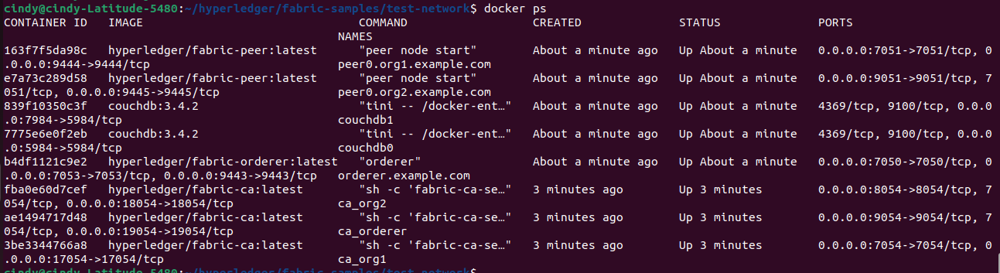

---

## 2️⃣ Extensión de la red para incluir una tercera organización

### 🛠 Solución

```bash
cd addOrg3
./addOrg3.sh up -c mychannel -s couchdb -ca
```

Verificación:

```bash
docker ps
```

### 📸 Evidencia

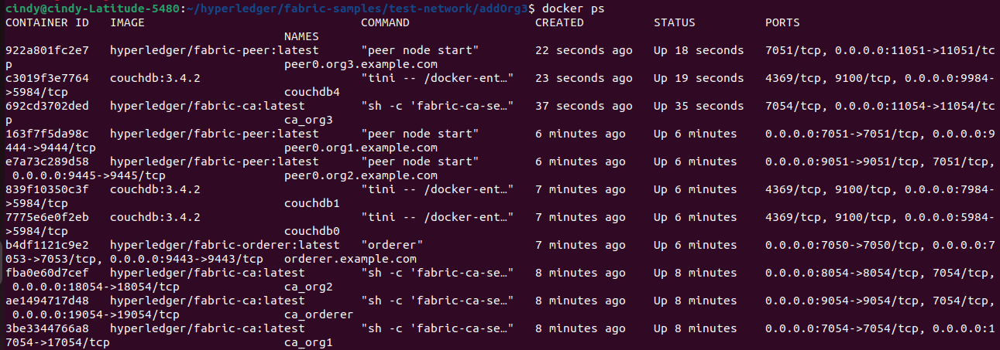

---

## 3️⃣ Limpieza de artefactos de red

### 🛠 Solución

```bash
./network.sh down
docker volume prune -f
```

---

# 2️⃣  Walking Through the Chaincode Lifecycle

## ⚙️ Scenario 1: Chaincode Implementation with 2 Organizations

Levantar la red:

```bash
./network.sh up createChannel -s couchdb -ca
```

Exportar variables:

```bash
export PATH="$PATH:$/home/cindy/hyperledger/fabric-samples/bin"
export TEST_NETWORK_FOLDER=/home/cindy/hyperledger/fabric-samples/test-network
export CORE_PEER_ADDRESS=localhost:7051
export CORE_PEER_LOCALMSPID="Org1MSP"
export CORE_PEER_MSPCONFIGPATH=${TEST_NETWORK_FOLDER}/organizations/peerOrganizations/org1.example.com/users/Admin@org1.example.com/msp
export CORE_PEER_TLS_ENABLED=true
export CORE_PEER_TLS_ROOTCERT_FILE=${TEST_NETWORK_FOLDER}/organizations/peerOrganizations/org1.example.com/peers/peer0.org1.example.com/tls/ca.crt
export FABRIC_CFG_PATH=/home/cindy/hyperledger/fabric-samples/config
```

Desplegar el contrato:

```bash
./network.sh deployCC \
  -ccn helloContract \
  -ccp ../chaincodes/hello_contract_3 \
  -ccl javascript \
  -ccv 3 \
  -cci InitLedger
```

### 📸 Evidencia

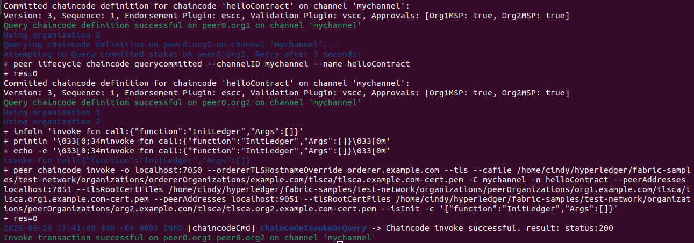

---

## ⚙️ Scenario 2: Source Code Change and Repackaging (Org3)

Desplegar el contrato:

```bash
./network.sh deployCC \
  -ccn helloContract \
  -ccp ../chaincodes/hello_contract_3 \
  -ccl javascript \
  -ccv 3 \
  -cci InitLedger
```

Verificación de datos:

```bash
peer chaincode query -C mychannel -n helloContract -c '{"Args":["getAll"]}' | jq .
```

📸 Evidencia:

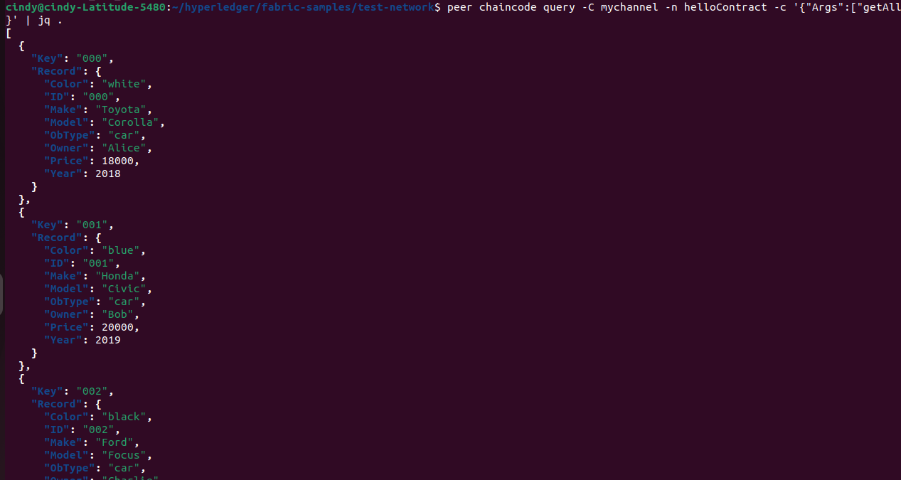

Registrar un asset:

```bash
peer chaincode invoke \
  -o localhost:7050 \
  --ordererTLSHostnameOverride orderer.example.com \
  --tls \
  --cafile ${PWD}/organizations/ordererOrganizations/example.com/orderers/orderer.example.com/msp/tlscacerts/tlsca.example.com-cert.pem \
  -C mychannel \
  -n helloContract \
  --peerAddresses localhost:7051 \
  --tlsRootCertFiles ${PWD}/organizations/peerOrganizations/org1.example.com/peers/peer0.org1.example.com/tls/ca.crt \
  --peerAddresses localhost:9051 \
  --tlsRootCertFiles ${PWD}/organizations/peerOrganizations/org2.example.com/peers/peer0.org2.example.com/tls/ca.crt \
  -c '{"function":"put","Args":["car","062","{\"ID\":\"062\",\"Make\":\"Chery\",\"Model\":\"MT-07\",\"Color\":\"grey\",\"Year\":2025,\"Owner\":\"Cindy\",\"Price\":7500,\"objType\":\"car\"}"]}'
```

📸 Evidencia:

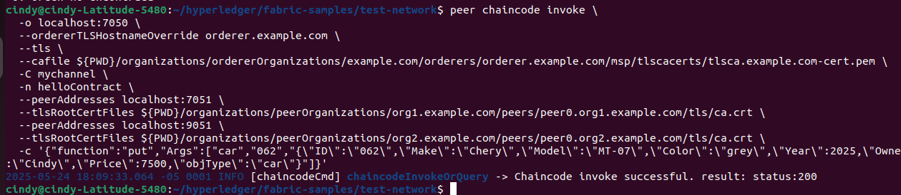

Consulta del asset:

```bash
peer chaincode query \
  -C mychannel \
  -n helloContract \
  -c '{"function":"get","Args":["car","062"]}'
```

📸 Evidencia:

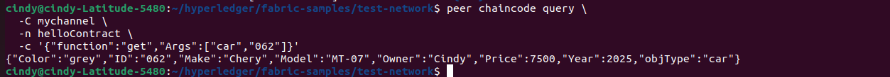

---

## ⚙️ Scenario 3: Extensión de red + aprobación de contrato por Org3

Agregar Org3:

```bash
cd addOrg3
./addOrg3.sh up -c mychannel -s couchdb -ca
```

Empaquetar el contrato:

```bash
peer lifecycle chaincode package helloContract_3.tar.gz \
  --path ../../chaincodes/hello_contract_3 \
  --lang node \
  --label helloContract_3
```

Instalar en Org3:

```bash
export CORE_PEER_LOCALMSPID="Org3MSP"
export CORE_PEER_TLS_ROOTCERT_FILE=$PWD/../organizations/peerOrganizations/org3.example.com/peers/peer0.org3.example.com/tls/ca.crt
export CORE_PEER_MSPCONFIGPATH=$PWD/../organizations/peerOrganizations/org3.example.com/users/Admin@org3.example.com/msp
export CORE_PEER_ADDRESS=localhost:11051

peer lifecycle chaincode install helloContract_3.tar.gz
```

📸 Evidencia:

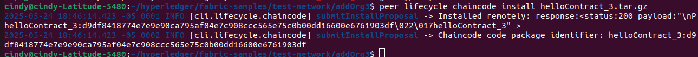

Obtener package ID:

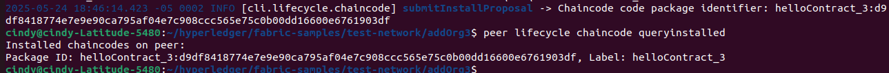

Obtener bloque génesis:

```bash
export FABRIC_CFG_PATH=$PWD
export FABRIC_CFG_PATH=~/hyperledger/fabric-samples/config

peer channel fetch 0 mychannel.block \
  --orderer localhost:7050 \
  --ordererTLSHostnameOverride orderer.example.com \
  --tls \
  --cafile /home/cindy/hyperledger/fabric-samples/test-network/organizations/ordererOrganizations/example.com/orderers/orderer.example.com/msp/tlscacerts/tlsca.example.com-cert.pem \
  -c mychannel
```

📸 Evidencia:

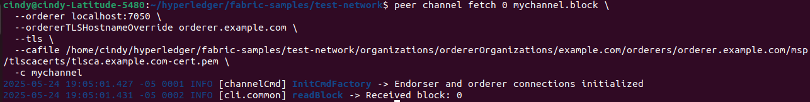

Unir Org3 al canal:

```bash
peer channel join -b mychannel.block
```

📸 Evidencia:

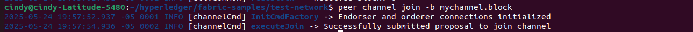

Aprobar el chaincode para Org3:

```bash
export CORE_PEER_LOCALMSPID="Org3MSP"
export CORE_PEER_ADDRESS=localhost:11051
export CORE_PEER_TLS_ROOTCERT_FILE=$PWD/organizations/peerOrganizations/org3.example.com/peers/peer0.org3.example.com/tls/ca.crt
export CORE_PEER_MSPCONFIGPATH=$PWD/organizations/peerOrganizations/org3.example.com/users/Admin@org3.example.com/msp

peer lifecycle chaincode approveformyorg \
  --orderer localhost:7050 \
  --ordererTLSHostnameOverride orderer.example.com \
  --channelID mychannel \
  --name helloContract \
  --version 3 \
  --package-id helloContract_3:d9df8418774e7e9e90ca795af04e7c908ccc565e75c0b00dd16600e6761903df \
  --sequence 1 \
  --init-required \
  --tls \
  --cafile $PWD/organizations/ordererOrganizations/example.com/orderers/orderer.example.com/msp/tlscacerts/tlsca.example.com-cert.pem
```

Verificación:

```bash
peer lifecycle chaincode querycommitted --channelID mychannel --name helloContract
```

📸 Evidencia:

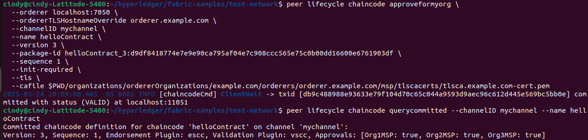
